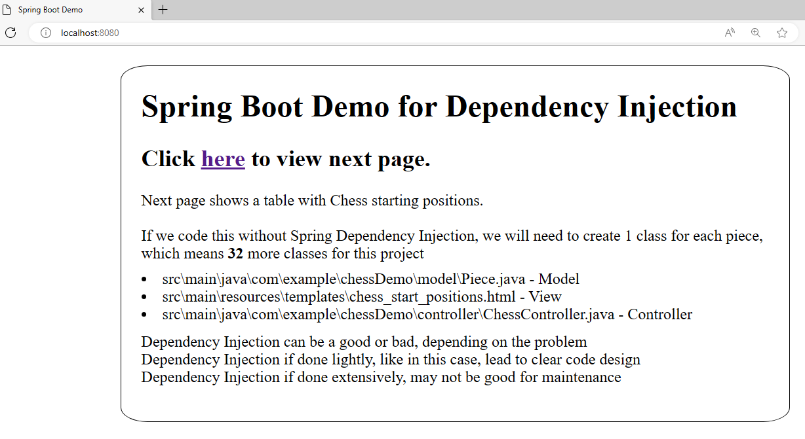
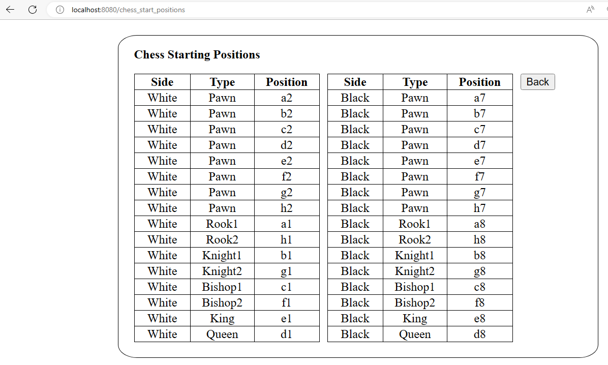
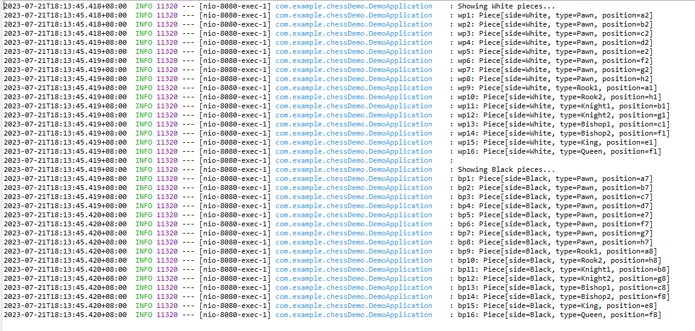

### Spring Boot Demo 7 Dependency Injection Example (HTML page with Chess Starting Positions)

**Steps:**
<ol>
<li>To setup IDE for Spring project, follow steps in https://github.com/worldpeacez0991/SpringBoot_demo1</li>

 

<li>Start Spring Boot App
<ul>
<li>Via Spring IDE, open 'DemoApplication.java', press 'Alt+Shift+X, B', to start 'Spring Boot App' 
This shows how to use Dependency Injection in a Spring Boot Application</li> 
<li>Via browser, type 'http://localhost:8080/', to view home page.</li>
<kbd></kbd>  
<li>Via browser, Click 'here', to view page 'Chess Starting Positions'.</li>
<kbd></kbd> 
<kbd></kbd>
</ul>
</li>

 

 
Credits: https://spring.io/team 
Source: https://www.baeldung.com/inversion-control-and-dependency-injection-in-spring 
Source: https://www.geeksforgeeks.org/spring-dependency-injection-with-example/amp/ 
Discussion: https://stackoverflow.com/questions/6550700/inversion-of-control-vs-dependency-injection 

